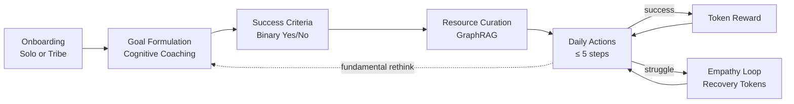

# 🌐 AGORA

### *Agentic, Goal-Oriented, Reflective, Adaptive academy*

**World-class coaching for everyone, everywhere.**

---

## What is AGORA?

AGORA is an **agentic learning platform** that delivers personalised, world-class coaching to anyone with a budget smartphone — especially learners in rural, minority, or under-served communities who cannot afford a human coach.

Instead of lecturing, AGORA puts a **Cognitive Coach** at the centre of the experience. It refuses to give answers. It paraphrases, pauses, and asks open-ended questions until *you* arrive at clarity. Then it walks you (or your tribe of three) through a strict five-stage learning state machine — Goal → Criteria → Resources → Actions → Feedback — wrapped in an empathetic, gamified token economy.

> "The teacher's job is not to fill the bucket. It is to light the fire." — *Yeats*  
> AGORA is the matchstick.

---

## Why this exists

Three observations from the founding team's discovery sessions:

1. **Tokens are cheap, expertise is not.** Inference for one person or a tribe of three is now affordable. World-class instruction can be democratised.
2. **Humans need tribes.** Solo self-study fails. A trusted micro-group of 3–4 learners with binary, public goals dramatically increases retention.
3. **Cognitive coaching beats lecturing.** Open questions + paraphrasing + pauses (the *Adaptive Schools* method, popularised by Brené Brown's *"What does done look like?"*) produces deeper, longer-lasting transformation than any classroom.

AGORA wraps these three insights in a modern, mobile-first, real-time PWA.

---

## The Specification

This repository is **spec-driven**. There is no code yet — only a complete, implementation-ready Software Design Document (SDD) that any competent team (human or LLM) can build from.

| # | Document | What's inside |
|--:|----------|---------------|
| 00 | [Overview](docs/00_OVERVIEW.md) | One-page mental model of the entire system |
| 01 | [Vision & PRD](docs/01_VISION_AND_PRD.md) | Product vision, target users, functional & non-functional requirements |
| 02 | [Personas & Journeys](docs/02_PERSONAS_AND_JOURNEYS.md) | Four personas, three end-to-end journeys |
| 03 | [State Machine](docs/03_STATE_MACHINE.md) | The five-state learning loop with strict gatekeeping |
| 04 | [System Architecture](docs/04_SYSTEM_ARCHITECTURE.md) | C4 diagrams, runtime topology, technology choices |
| 05 | [Data Model](docs/05_DATA_MODEL.md) | ERD, full PostgreSQL schema, RLS policies |
| 06 | [API Contracts](docs/06_API_CONTRACTS.md) | REST, Realtime channels, RPC, SSE streaming |
| 07 | [Agent Architecture](docs/07_AGENT_ARCHITECTURE.md) | Multi-agent orchestration with LangGraph, tool use, guardrails |
| 08 | [RAG & Knowledge Graph](docs/08_RAG_AND_KNOWLEDGE_GRAPH.md) | GraphRAG, hybrid retrieval, ingestion pipeline |
| 09 | [Pedagogical Engine](docs/09_PEDAGOGICAL_ENGINE.md) | FSRS spaced repetition, knowledge tracing, mastery |
| 10 | [Gamification & Token Economy](docs/10_GAMIFICATION_AND_TOKENS.md) | The token ledger, leaderboards, recovery rewards |
| 11 | [Empathy Loop](docs/11_EMPATHY_LOOP.md) | Affective computing, struggle detection, recovery protocol |
| 12 | [UI/UX Specification](docs/12_UI_UX_SPEC.md) | Screen-by-screen interaction spec |
| 13 | [Design System](docs/13_DESIGN_SYSTEM.md) | Tokens, components, glassmorphism, motion |
| 14 | [Accessibility & I18n](docs/14_ACCESSIBILITY_AND_I18N.md) | WCAG 2.2 AA, EAA 2025, i18n, RTL, voice-first |
| 15 | [Security & Privacy](docs/15_SECURITY_AND_PRIVACY.md) | Threat model, RBAC, RLS, GDPR, PII redaction |
| 16 | [Observability & Evals](docs/16_OBSERVABILITY_AND_EVALS.md) | LLM tracing, eval suites, LLM-as-Judge |
| 17 | [Testing Strategy](docs/17_TESTING_STRATEGY.md) | Test pyramid, agent evals, chaos testing |
| 18 | [Deployment](docs/18_DEPLOYMENT.md) | CI/CD, environments, rollback, mock-mode |
| 19 | [Demo Script](docs/19_DEMO_SCRIPT.md) | The 7-minute hackathon narrative |
| 20 | [Build Roadmap](docs/20_BUILD_ROADMAP.md) | Phased delivery plan with explicit cut-lines |
| — | [Glossary](docs/GLOSSARY.md) | Every term defined in one place |
| — | [ADRs](docs/adr/) | Architecture Decision Records |
| — | [Diagrams](docs/diagrams/) | Mermaid sources for every diagram |
| — | [Prompts](docs/prompts/) | Ready-to-use system prompts for every agent |

---

## At a glance

---

## Tech stack — the short version

| Layer | Choice | Why |
|-------|--------|-----|
| Frontend | **React 19 + Vite + TypeScript + Tailwind v4** | Modern, fast, type-safe |
| State | **TanStack Query + Zustand + Supabase Realtime** | Server cache, lean client state, CRDTs-where-needed |
| Backend | **Supabase** (Postgres 16, Realtime, Edge Functions, Storage, Auth) | Single BaaS, real-time first |
| Vectors | **pgvector + pg_trgm + Apache AGE** | Hybrid vector + lexical + graph retrieval — all in Postgres |
| Agents | **LangGraph** (TypeScript) running in Edge Functions | Stateful multi-agent orchestration, replayable |
| LLM | **Provider-agnostic** (OpenAI, Anthropic, local Ollama) via [Vercel AI SDK](https://sdk.vercel.ai) | No vendor lock-in, streaming first |
| Voice | **Web Speech API** (primary) + **Whisper** edge fallback | Zero-cost on capable devices |
| Spaced rep | **FSRS-6** (Free Spaced Repetition Scheduler) | State-of-the-art, open algorithm |
| Realtime collab | **Yjs** CRDT over Supabase Realtime | Conflict-free multi-user editing |
| Observability | **Langfuse** (self-hosted) + **OpenTelemetry** | Full LLM trace + product analytics |
| PWA | **Vite PWA + Workbox** | Offline-first, installable, push notifications |
| Testing | **Vitest + Playwright + DeepEval** | Unit, E2E, agent eval |
| Deploy | **Vercel** (frontend) + **Supabase Cloud** (backend) | One-click, edge-distributed |

See [04_SYSTEM_ARCHITECTURE.md](docs/04_SYSTEM_ARCHITECTURE.md) for the full reasoning and [ADRs](docs/adr/) for the trade-offs.

---

## What's *new* compared to the v1 specification

This SDD takes the foundational vision from the team's audio sessions, the partial Gemini 3.1-pro draft, and the production-tested mechanics from the prior `cartel-io` codebase, then adds **2025–2026 EdTech state-of-the-art**:

- **Multi-agent orchestration** with LangGraph and tool-calling — not a single brittle prompt.
- **GraphRAG** (vector + knowledge graph) instead of flat embeddings.
- **FSRS-6** spaced repetition replacing naive SM-2.
- **Bayesian Knowledge Tracing** for mastery estimation per concept.
- **Affective computing** for the Empathy Loop — sentiment + behavioural signals, not just self-report.
- **Open Badges 3.0 / Verifiable Credentials** for goal completion.
- **Local-first option** with Yjs CRDT for offline collaboration.
- **WCAG 2.2 AA + EAA 2025** compliance baked into the design system.
- **LLM-as-Judge eval suites** with regression gates in CI.
- **Privacy-preserving by default** — PII redaction at ingest, RLS at every table, per-tribe data isolation.
- **Voice-first** — full keyboard, screen-reader, and dictation parity.
- **Mock-mode toggle** for flawless live demos under any network.

---

## Contributing

This is a hackathon kick-off. Read [20_BUILD_ROADMAP.md](docs/20_BUILD_ROADMAP.md), pick a slice, ship it.

The cardinal rule: **the spec is the source of truth.** If the code disagrees with the spec, fix one of them — but never silently.

---

*Built with care for the learners the rest of EdTech forgot.*

