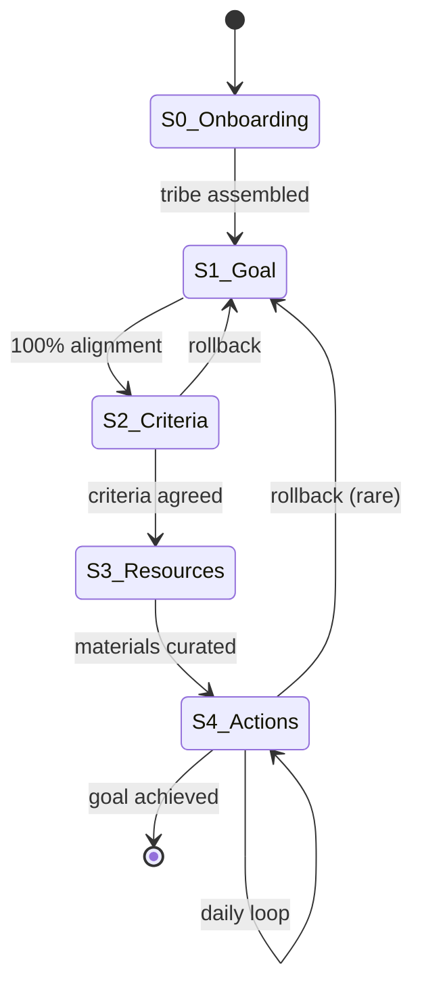
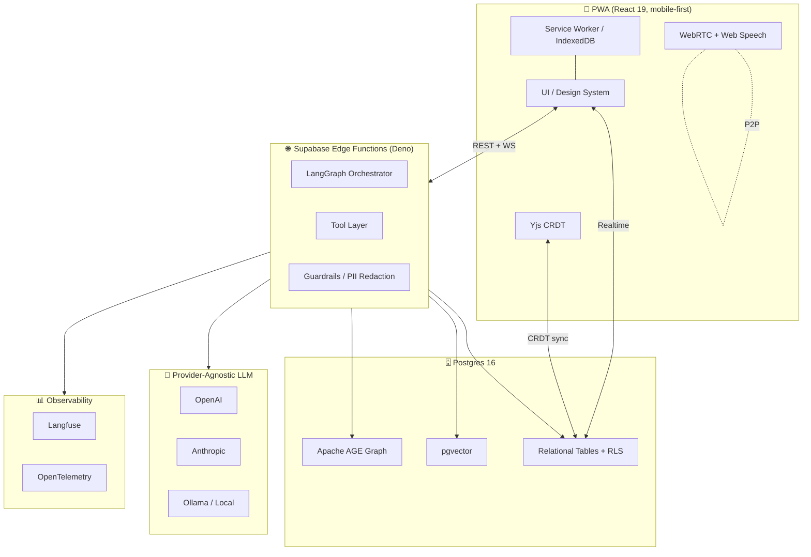

# 00 — Overview

> One page. Read this first. Everything else is the elaboration.

---

## The problem

A talented learner in a small village in northern Morocco wants to switch careers into data science. There is no coach within 200 km. A human tutor would cost €60/hour. Free YouTube content is overwhelming, unstructured, and lonely. Existing AI chatbots happily hallucinate answers, removing the cognitive struggle that produces real learning.

There are millions of these learners.

## The product

**AGORA** is a mobile-first PWA that gives every learner — solo or in a tribe of 3–4 — a personal **Cognitive Coach** powered by a multi-agent system. The coach refuses to give answers. It paraphrases, pauses, and asks open-ended questions until the learner formulates their own goal, defines binary success criteria, curates the right resources, executes ≤ 5 actions per day, and is celebrated (or empathically rescued) by a token economy.

## The five-state loop

Each transition is **gated** — no skipping, no shortcuts. The state machine is the discipline that turns "I want to learn French" into "I will hold a 5-minute conversation with a native speaker by July 1st".

## The four agents

| Agent | When it runs | What it does | What it must NOT do |
|-------|-------------|--------------|----------------------|
| **Cognitive Coach** | S1, S2 | Paraphrase + pause + open questions | Give answers, suggest goals |
| **Criteria Verifier** | S2 | Force binary, provable outcomes | Accept vague metrics |
| **Curator** (RAG) | S3 | GraphRAG over the tribe's library | Leak data across tribes |
| **Empathy Coach** | S4 | Detect struggle, generate recovery tasks, award Recovery Tokens | Penalise, shame, or pressure |
| **Synthetic Companion** | Solo mode, all states | Simulate a peer learner with shared struggles | Coach or instruct |

See [07_AGENT_ARCHITECTURE.md](07_AGENT_ARCHITECTURE.md).

## The architecture in one diagram

## Non-negotiables

1. **Privacy first.** Every row is RLS-protected. Tribe A cannot see tribe B's existence, ever.
2. **Mobile first.** Designed for a 320 px viewport, throttled 3G, and a one-thumb interaction model.
3. **Offline first.** Reading, note-taking, and action completion work with no connectivity. Sync on reconnect.
4. **A11y first.** WCAG 2.2 AA, EAA 2025. Voice, keyboard, and screen-reader parity.
5. **Provider-agnostic LLMs.** Swap OpenAI ↔ Anthropic ↔ local Ollama via configuration.
6. **Spec-driven.** Code follows spec. Spec updated only via PR.
7. **Mock-mode for demos.** A single env var (`USE_MOCKS=true`) replaces every external call with deterministic fixtures.

## What success looks like for the hackathon

- A live, deployed PWA at `agora.app` (or the chosen domain).
- A 7-minute demo (see [19_DEMO_SCRIPT.md](19_DEMO_SCRIPT.md)) that walks through the full state machine, including a real-time tribe consensus, a struggling user being rescued by the Empathy Loop, and a flashcard set generated on the fly from a user-uploaded PDF.
- Zero rate-limit failures during the demo (mock-mode armed).
- All tier-0 features (see [20_BUILD_ROADMAP.md](20_BUILD_ROADMAP.md)) shipped and tested.

## What this document is *not*

- A marketing brief.
- A pitch deck.
- An invitation for scope creep.

It is an engineering contract.
