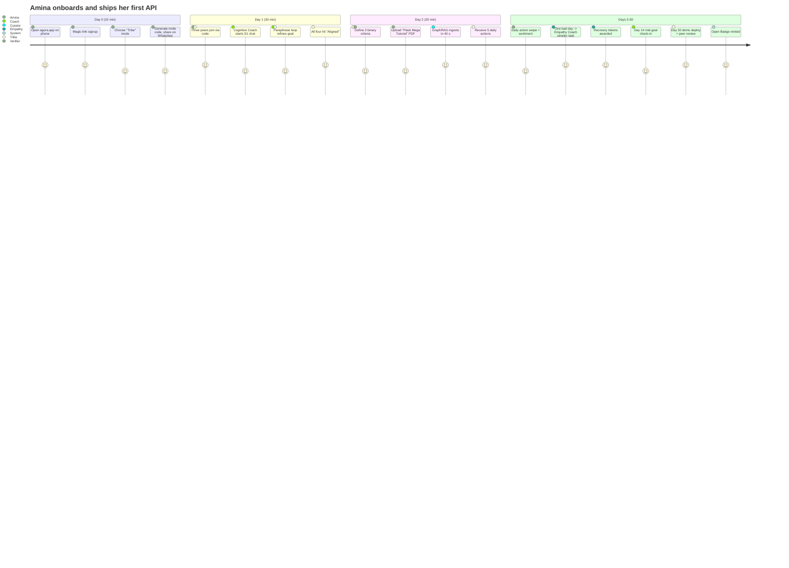
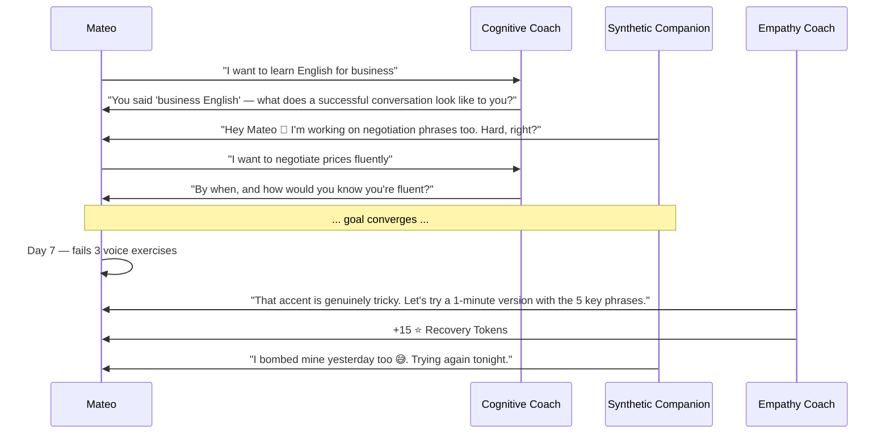

# 02 — Personas & Journeys

## Personas

### 👤 Persona 1 — Amina, 26, Casablanca outskirts

- **Background:** Trained as a primary-school teacher; lost her job during a budget cut. Wants to become a back-end developer.
- **Devices:** Xiaomi Redmi 9 (Android 11), 4 GB RAM. Public Wi-Fi at the library, mobile data otherwise.
- **Languages:** Arabic (native), French (fluent), English (intermediate).
- **Pain:** All bootcamps cost €4 000+. Free tutorials are ocean-deep and goal-less. She has no peers learning the same thing.
- **Goal she'd type into AGORA:** *"I want to become a back-end developer in 6 months."*
- **What AGORA does for her:** Refines the goal to *"Build and deploy a CRUD REST API in Python by April 30 with three peer reviewers signing off."*, assembles a tribe of three other career-switchers, curates resources, and runs daily 25-min actions.

### 👤 Persona 2 — Mateo, 34, rural Colombia

- **Background:** Coffee farmer wanting to learn enough English to sell directly to international buyers.
- **Devices:** Motorola E13 (Android 13 Go edition), 2 GB RAM. Spotty 3G.
- **Languages:** Spanish (native).
- **Pain:** Duolingo gamifies but doesn't tie to *his* business goal. Cannot afford Cambly.
- **Goal:** *"Hold a 5-minute price negotiation in English by harvest season."*
- **What AGORA does for him:** Solo mode + Synthetic Companion ("Carlos" — also learning English for trade). Daily 15-min role-play actions with voice dictation. Recovery loops when accent practice frustrates him.

### 👤 Persona 3 — The Lisbon Trio

- **Background:** Three friends preparing for the Portuguese medical residency exam.
- **Devices:** Mixed (one iPhone 12, two mid-range Androids).
- **Languages:** Portuguese, English.
- **Pain:** No structure, drift, the strongest student leaves the others behind.
- **Goal:** *"All three pass the cardiology section of the residency exam in May with ≥ 75 %."*
- **What AGORA does for them:** Tribe alignment forces explicit consensus. The Empathy Loop catches the lagging member early. Shared knowledge graph builds collective long-term memory. Group flashcard review with FSRS-6.

### 👤 Persona 4 — Dr. Ngozi, 41, Lagos

- **Background:** Public-health researcher running a community study group on vaccine literacy.
- **Devices:** MacBook Air (desktop) + Tecno phones (community).
- **Languages:** English, Yoruba.
- **Pain:** Needs admin tools — invites, moderation, removing inactive members. Existing platforms either too consumer or too enterprise.
- **Goal:** *"Onboard 8 community members across 2 tribes; goal: 80 % can answer 10 vaccine-fact questions correctly."*
- **What AGORA does for her:** RBAC (Admin, Moderator, Member). Per-tribe knowledge bases. Mastery dashboards via Bayesian Knowledge Tracing. Open Badge 3.0 issued on completion.

---

## Journey 1 — Amina, Day 0 to Day 30



### Key states traversed

| Day | State | Notable events |
|----:|-------|----------------|
| 0 | S0 | Magic-link, mode select |
| 1 | S0 → S1 | Tribe assembled, coach activated |
| 1 | S1 | 12 messages, 100 % alignment |
| 2 | S1 → S2 | 3 criteria defined |
| 2 | S2 → S3 | Resources curated |
| 3+ | S4 | Daily loop, occasional Empathy detours |
| 30 | Goal complete | VC issued, badge in user wallet |

---

## Journey 2 — Mateo, Solo with Synthetic Companion

The Synthetic Companion ("Carlos") is generated at S0 and persists across all states. Carlos is **clearly tagged AI** in every UI surface, has a distinctive avatar tone, and never coaches Mateo.



---

## Journey 3 — Lisbon Trio rebuilds after a setback

Day 18 of a 90-day study plan. Member B (Sofia) reports 😞 sentiment for 4 consecutive days. The Empathy Loop fires, the system flags this to the tribe Moderator (Member A, João), and proposes a tribe-level rollback to S2 (criteria) to re-balance scope.

```mermaid
flowchart LR
    A[Day 18: Sofia 4×😞] --> B[Empathy Coach detects struggle]
    B --> C[Generate easier daily action]
    B --> D[Notify Moderator João]
    D --> E{Tribe meeting<br/>(WebRTC visio)}
    E -->|Consensus: scope too aggressive| F[Rollback to S2]
    F --> G[Refine criteria: 70% → 65%]
    G --> H[Resume S4 with new pace]
    E -->|Consensus: stay the course| I[Continue, Sofia gets pair-buddy]
```

---

## Journey 4 — Dr. Ngozi runs a multi-tribe program

Dr. Ngozi acts as **Admin** of an organisation account (a v1 lightweight grouping). She can:

- Create tribes and assign Moderators.
- View aggregate (anonymised) progress dashboards across tribes.
- Issue Open Badges on goal completion.
- Export GDPR-compliant CSV / JSON of her organisation's data.

She **cannot** read messages inside tribes (RLS enforced even for Admins of orgs). Privacy is non-negotiable.

---

## Cross-journey UX principles distilled

1. **First useful action in ≤ 90 s.** From cold tap to "tribe assembled and chatting" must take under 90 s on 3G.
2. **Every screen has a one-thumb path.** No double-handed gestures.
3. **The cognitive load decreases as the user descends the funnel.** S1 is the most demanding (multi-user chat, voting); S4 is simple swipe cards.
4. **Empathy outranks streaks.** When a streak conflicts with empathy, empathy wins.
5. **The system never hides cost.** Tokens are abundant by design but the user always knows their balance.

---

See [03_STATE_MACHINE.md](03_STATE_MACHINE.md) for the formal definition of the states traversed in these journeys.
