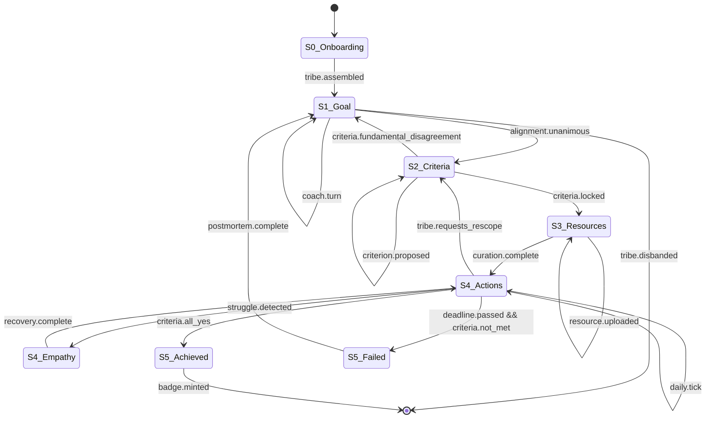
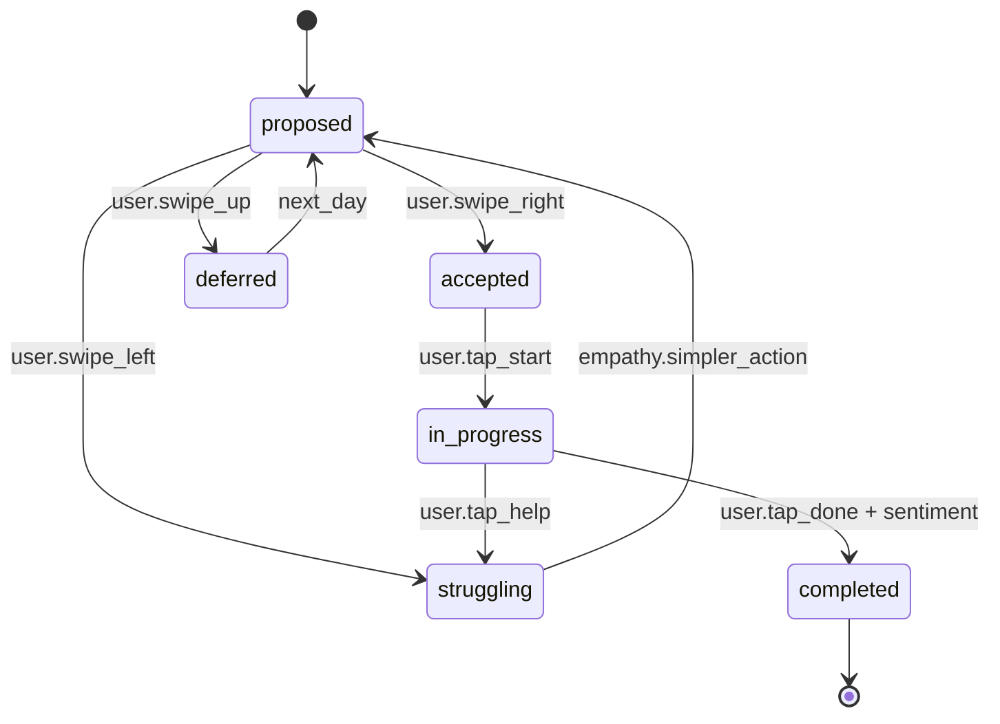

# 03 — State Machine

The educational core of AGORA is a strict, finite-state machine. **Progression is gated.** No state may be skipped. Rollbacks are explicit and audit-logged.

---

## 1. Top-level state diagram

---

## 2. State definitions

Each state has: **purpose**, **entry preconditions**, **invariants** that must hold while in the state, and **exit conditions**.

### 2.1 S0 — Onboarding & Tribe Assembly

| Field | Value |
|------:|-------|
| **Purpose** | Authenticate, choose mode, assemble the tribe. |
| **Entry** | User clicks the magic-link or returns to a tribe in S0. |
| **Invariants** | `tribe.size ∈ [0, 4]`; no goal exists yet. |
| **Exit** | `tribe.size ≥ 1` (Solo) **or** all invited slots filled, **and** the tribe taps "Begin". |
| **Roles** | Creator becomes `admin` of the tribe; others join as `member`. |
| **Data writes** | `tribes`, `tribe_members`, `synthetic_companions` (if Solo). |
| **Notifications** | Push on each member join. |

#### Sub-flow: Solo vs Tribe
- **Solo** → instantiate `synthetic_companion` row, assign avatar + persona seed.
- **Tribe** → generate 6-char invite code (`Crockford base32`, TTL 24 h, single-use per redemption).

### 2.2 S1 — Goal Formulation

| Field | Value |
|------:|-------|
| **Purpose** | Refine raw desire into a SMART(ER) goal via cognitive coaching. |
| **Entry** | Tribe assembled; first message from any member. |
| **Invariants** | The Cognitive Coach **must** never produce a non-paraphrase, non-question turn. The conversation thread is shared real-time. |
| **Exit** | All members hit the **Aligned** button on the same `goal.draft_version`. |
| **Roles** | Anyone can propose a refinement; the system aggregates. |
| **Data writes** | `messages`, `goal_drafts`, `alignment_votes`. |
| **Failure modes** | Stalled chat (> 24 h silence) → nudge push. Tribe disbands → archive draft. |

The **alignment widget** displays a 4-up grid of avatars with green/grey state. Transition to S2 fires only on `unanimous = true`.

### 2.3 S2 — Success Criteria Definition

| Field | Value |
|------:|-------|
| **Purpose** | Translate the goal into 1–5 binary, provable criteria. |
| **Entry** | S1 unanimous alignment. |
| **Invariants** | Every criterion has `verification_method ∈ {self_attestation, photo_proof, peer_review, quiz_score, external_log}`. The Verifier agent rejects subjective criteria with explicit rationale. |
| **Exit** | The tribe accepts the criteria set; system locks `goals.status = active`. |
| **Rollback** | If a member triggers `fundamental_disagreement` (UI: "We disagree on what success means"), the FSM returns to S1 with the disagreement context preserved. |
| **Data writes** | `success_criteria`, `goals.status`. |

### 2.4 S3 — Resource Curation

| Field | Value |
|------:|-------|
| **Purpose** | Build the tribe's Knowledge Graph for this goal. |
| **Entry** | S2 criteria locked. |
| **Invariants** | All ingested resources are tagged with `tribe_id`. Vector queries are RLS-isolated. |
| **Exit** | The tribe taps "Start" on the daily loop, **and** at least one resource per criterion is linked. |
| **Data writes** | `resources`, `resource_chunks`, `embeddings`, `kg_nodes`, `kg_edges`. |
| **Curator agent** | Suggests 3+ public-commons sources, accepts user uploads, links them in the graph. |

### 2.5 S4 — Daily Actions & Feedback

| Field | Value |
|------:|-------|
| **Purpose** | Execute the curriculum one Pomodoro at a time. |
| **Entry** | S3 complete; a fresh "day" tick fires per user (see *day boundary* below). |
| **Invariants** | `actions.daily_count ≤ 5`; each action `duration_min ≤ 25`. |
| **Exit (success)** | All success criteria flip to `met = true` → S5_Achieved. |
| **Exit (failure)** | `goals.deadline < now()` AND not all criteria met → S5_Failed. |
| **Sub-state**: **S4_Empathy** | Triggered by struggle signals (see [11_EMPATHY_LOOP.md](11_EMPATHY_LOOP.md)). |

#### Day boundary
A "day" is per-user, anchored to the user's `tz_offset` and `daily_anchor` setting (default 06:00 local). Daily proposed actions persist exactly 24 h or until completed/dismissed.

#### Action lifecycle

### 2.6 S5 — Goal Outcome

Two terminal-but-reentrant states: **Achieved** and **Failed**.

- **Achieved** → mint Open Badge 3.0 (W3C VC), award completion bonus, propose new goal cycle.
- **Failed** → run a **postmortem ritual**: the Coach asks 3 retrospective questions ("What changed mid-flight?", "What would you change?", "What surprised you?"). The output seeds S1 of the next iteration.

---

## 3. Gatekeeping rules

| Transition | Gate | Enforcement |
|-----------|------|-------------|
| S0 → S1 | tribe assembled, all opted-in | Edge function check |
| S1 → S2 | unanimous alignment vote on the same `goal.draft_version` | DB CHECK + edge function |
| S2 → S3 | criteria locked, all carry verification methods | DB CHECK |
| S3 → S4 | ≥ 1 resource per criterion ingested | Edge function |
| S4 → S5 | criteria evaluation function returns `all_met` OR deadline elapsed | Scheduled cron |

Every transition emits an event to `state_transitions` (append-only audit log) with `from_state`, `to_state`, `actor_user_id`, `payload_hash`, `timestamp`.

---

## 4. Edge & error states

| Error | Behaviour |
|-------|-----------|
| LLM provider down | Auto-fallback to next provider; if all fail → mock-mode banner, queued retry |
| Member abandons mid-S1 | After 7 days inactivity, member auto-removed; if tribe drops below threshold, tribe pauses |
| Resource ingestion fails | Resource marked `ingestion_status = failed`, user notified, retry button shown |
| Synthetic Companion drift | Drift detector checks daily; reset via persona seed if KL-divergence > threshold |
| Privacy breach detected | Immediate hard-stop, all RLS policies re-validated, incident logged at P0 |

---

## 5. Why a strict FSM?

The vision documents emphasise **discipline**: no shortcuts, no skipping. The FSM **is** the pedagogical discipline:

- It prevents users from jumping to actions before clarity.
- It prevents the LLM from wandering off-task.
- It produces an auditable, replayable record per tribe.
- It maps cleanly to UI affordances — each state owns specific screens and forbids others.

The audit log doubles as **data for evals**: every transition is a labelled event, perfect for offline analysis of where tribes succeed or stall.

---

See [07_AGENT_ARCHITECTURE.md](07_AGENT_ARCHITECTURE.md) for how each state activates a different agent in the LangGraph orchestrator.
