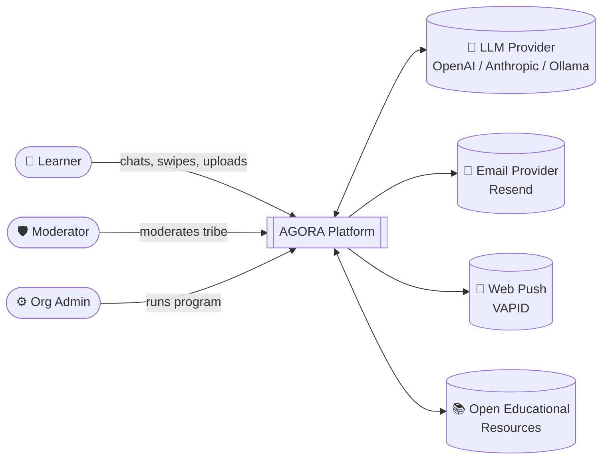
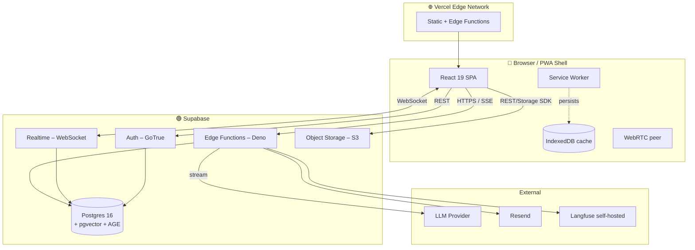
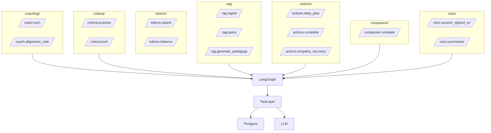
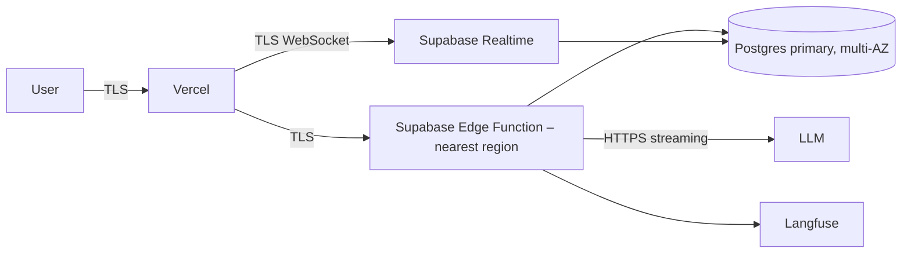

# 04 — System Architecture

## 1. Architectural style

AGORA is a **serverless-first, real-time, edge-distributed** Progressive Web App built on a Supabase Backend-as-a-Service core. The architecture follows the **C4 model** (Context → Container → Component → Code).

### Guiding principles

1. **Postgres is the centre.** Relational data, vector embeddings, knowledge graph, RLS, and realtime pub/sub all live in one Postgres instance. One source of truth.
2. **Edge over central.** Compute runs at the user's nearest Vercel edge node and Supabase edge function region.
3. **Streaming over polling.** SSE for LLM tokens, WebSockets for real-time state, push notifications for awakening.
4. **Optimistic UI, eventual consistency.** Yjs CRDT where multiple users co-edit; last-write-wins is unacceptable for the alignment vote.
5. **No service we cannot mock.** Every external dependency has a deterministic mock for demo, dev, and CI.

---

## 2. C4 — Context



---

## 3. C4 — Container



### Containers explained

| Container | Tech | Responsibility |
|-----------|------|----------------|
| **Web SPA** | React 19, Vite, Tailwind v4, TanStack Router | UI, FSM controller, optimistic UI |
| **Service Worker** | Workbox | Offline cache, push, background sync |
| **Vercel Edge** | Vercel Edge Runtime | Static delivery, light proxying, OG images |
| **Supabase Auth** | GoTrue | Magic link, OAuth, JWT issuance |
| **Postgres** | Postgres 16 + pgvector + Apache AGE | Relational + vector + graph |
| **Supabase Realtime** | Phoenix on top of WAL | Real-time pub/sub for chat, alignment, presence |
| **Edge Functions** | Deno + LangGraph | Agent orchestration, RAG, business logic |
| **Storage** | Supabase Storage (S3) | User uploads (PDFs, photos, audio) |
| **Langfuse** | Self-hosted | LLM tracing & evals |

---

## 4. C4 — Component (Edge Functions)

The Edge Function layer is divided into **vertical slices**, each owning a domain.



### LangGraph as the agent runtime

A single `LangGraph` definition encodes the multi-agent FSM mirror of the platform's user-facing FSM. The same graph is invoked across functions; only the entry node differs. See [07_AGENT_ARCHITECTURE.md](07_AGENT_ARCHITECTURE.md).

---

## 5. Runtime topology



- **Latency targets**: edge function p95 < 200 ms (excluding LLM); LLM first token p95 < 1.2 s.
- **Region anchoring**: Frankfurt for EU users, São Paulo for LATAM, Mumbai for SEA, all served by Supabase global edge replicas.

---

## 6. Frontend architecture

### 6.1 Module map

```
src/
├── app/                  # routing, providers, error boundaries
├── shared/               # design system, hooks, utils, types
├── features/
│   ├── onboarding/
│   ├── tribe/
│   ├── coaching/         # S1 chat, alignment widget
│   ├── criteria/         # S2 forms, verifier UI
│   ├── resources/        # S3 upload, KG mini-map
│   ├── actions/          # S4 swipe deck, sentiment capture
│   ├── flashcards/       # FSRS review surface
│   ├── empathy/          # recovery banner, recovery deck
│   ├── tokens/           # ledger, leaderboard
│   ├── visio/            # WebRTC, transcripts
│   └── settings/
├── lib/
│   ├── supabase/         # typed client (drizzle types optional)
│   ├── ai/               # streaming SSE client, prompt loaders
│   ├── fsm/              # XState machine mirroring server FSM
│   ├── i18n/             # ICU messages
│   └── pwa/              # service worker, push subscription
└── styles/
```

### 6.2 State management strategy

| Concern | Tool |
|---------|------|
| Server cache | TanStack Query v5 |
| Client UI state | Zustand (small) |
| Real-time docs (chat, KG, notes) | Yjs CRDT + Supabase Realtime adapter |
| FSM state | XState v5 (mirrors server, used for UI gating) |
| Routing | TanStack Router (file-based, type-safe) |
| Forms | React Hook Form + Zod resolver |

### 6.3 Streaming SSE pattern

LLM tokens stream from edge function → SSE → client. The client uses `EventSource` polyfilled with `fetch-event-source` for POST + headers. Each token is appended to a Yjs `Y.Text` so other tribe members see the agent type in real time.

---

## 7. Backend architecture

### 7.1 Supabase Edge Functions

Each function is a Deno script ≤ 1 MB bundled. Cold start < 100 ms.

```ts
// Example skeleton — coaching/turn.ts
serve(async (req) => {
  const { tribe_id, user_id, message } = await parse(req);
  await guard.assertMember(user_id, tribe_id);
  await guard.redactPII(message);

  const stream = orchestrator.run("coach.turn", {
    tribe_id, user_id, message,
  });

  return new Response(stream, { headers: SSE_HEADERS });
});
```

### 7.2 Database design choices

- **Single Postgres** with three superpowers:
  - `pgvector` for semantic search.
  - `Apache AGE` extension for openCypher graph queries.
  - `pg_trgm` for lexical search (BM25-like via `ts_rank` + trigram).
- **RLS on every table.** No exceptions.
- **No ORM at runtime** in edge functions (cold start); generated types via `supabase gen types` + tagged SQL templates. Drizzle in tooling only.

### 7.3 Realtime channels

| Channel | Producer | Consumer | Purpose |
|---------|----------|----------|---------|
| `tribe:{id}:chat` | Coach edge fn | Tribe members | LLM token stream |
| `tribe:{id}:alignment` | Vote endpoint | Members | Live alignment widget |
| `tribe:{id}:presence` | Phoenix presence | Members | Avatars online |
| `tribe:{id}:kg_updates` | Ingest pipeline | Members | Knowledge graph mini-map |
| `user:{id}:notifications` | Various | Single user | Personal nudges |

---

## 8. AI/LLM layer

### 8.1 Provider abstraction

```ts
// lib/ai/provider.ts
export interface LLMProvider {
  name: "openai" | "anthropic" | "ollama";
  chat(req: ChatRequest): AsyncIterable<TokenChunk>;
  embed(input: string[]): Promise<number[][]>;
  toolCall(req: ToolRequest): Promise<ToolResponse>;
}
```

Routing rules (configurable):
- **Coaching, Criteria, Empathy** → Claude 3.5 Sonnet (best at constrained, empathetic generation).
- **Curator, Pedagogical generators** → GPT-4.1 mini or Claude Haiku (cost-sensitive).
- **Embeddings** → `text-embedding-3-small` (1536-d) by default.
- **Local fallback** → Llama 3.1 8B via Ollama for privacy-first deployments.

### 8.2 Tool layer

The agents call tools — typed functions with JSON Schema:
- `kg.search(query, depth, tribe_id) → chunks[]`
- `kg.add_node(content, links[])`
- `criteria.validate(text) → { binary: boolean, rationale }`
- `tokens.award(user_id, amount, reason)`
- `actions.generate_simpler(action_id) → action`

### 8.3 Guardrails

Every LLM call passes through:
1. **PII redactor** (regex + Microsoft Presidio for production) on input.
2. **Constitutional checks** on output (no instructive answers in S1, no shame in Empathy).
3. **JSON schema validation** for tool calls.
4. **Length / cost cap** per turn.
5. **Toxicity filter** (Detoxify on edge or Azure Content Safety).

---

## 9. Real-time collaboration

For collaborative artefacts (chat, shared notes, knowledge graph), AGORA uses **Yjs** CRDT with the Supabase Realtime channel as the transport. Snapshots are persisted to a `crdt_state` table every 30 s. This gives:

- Conflict-free multi-user editing.
- Offline edits that sync on reconnect.
- Time-travel via snapshots.

---

## 10. PWA & offline

- **Manifest** with adaptive icons, theme colour, share target.
- **Service Worker** strategies:
  - `NetworkFirst` for HTML.
  - `StaleWhileRevalidate` for API GETs that are safe to be stale.
  - `BackgroundSync` queue for action completions captured offline.
- **IndexedDB** stores: action drafts, sentiment logs, flashcard reviews, the user's personal RAG cache.
- **Push notifications** via VAPID; opt-in surfaced after first action completion.

---

## 11. Security architecture

See [15_SECURITY_AND_PRIVACY.md](15_SECURITY_AND_PRIVACY.md) for the threat model. Highlights:

- TLS 1.3 everywhere.
- JWT (RS256) with 1 h lifetime, refresh via secure HttpOnly cookie.
- RLS on every table, every operation.
- Edge functions verify JWT and re-resolve user role on each call (no stale role caching).
- Storage objects scoped to `tribe_id/user_id` paths with RLS-aligned policies.
- CSP, HSTS, COOP, COEP headers.
- Subresource Integrity on all third-party scripts (none in v1).
- Daily automated `pgaudit` review of policy changes.

---

## 12. Observability

- **Langfuse** for every LLM trace: prompt, completion, tokens, latency, cost, eval scores.
- **OpenTelemetry** (OTLP/HTTP) → Grafana Cloud free tier for spans, metrics, logs.
- **Web Vitals** captured per route, aggregated.
- **Error tracking** via Sentry (or self-hosted GlitchTip).
- **Product analytics** via PostHog (self-hosted). PII-redacted by default.

---

## 13. Deployment topology

| Environment | Purpose | Branch | Gating |
|-------------|---------|--------|--------|
| `local` | dev | any | none |
| `preview` | per-PR | `pr/*` | typecheck + unit tests + agent eval pass |
| `staging` | demo dress-rehearsal | `main` | preview gates + Playwright E2E + a11y audit |
| `production` | live | tag `v*` | manual approval + smoke tests |

---

## 14. Key non-goals (architectural)

- ❌ Microservices. We use modular edge functions, but they share schema and runtime — not Kafka, not gRPC.
- ❌ Self-hosted LLMs in v1 production (Ollama only for local dev / privacy demos).
- ❌ Native mobile binaries.
- ❌ Multi-tenant in the SaaS sense (we are single-product; "tribes" are the tenancy unit, not orgs).

---

See [05_DATA_MODEL.md](05_DATA_MODEL.md) for the full schema, [06_API_CONTRACTS.md](06_API_CONTRACTS.md) for endpoints.
