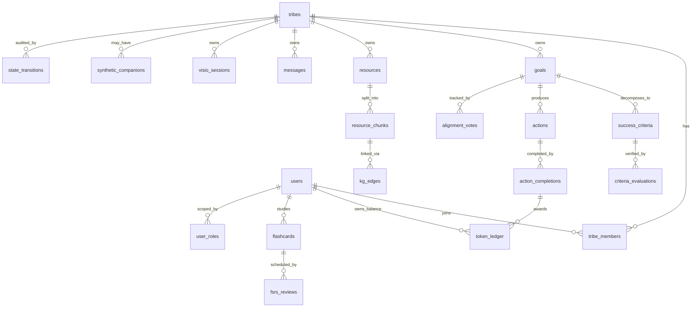

# 05 — Data Model

## 1. Conceptual ERD



## 2. Tables — full SQL definition

> Conventions: every table has `id uuid PK default gen_random_uuid()`, `created_at timestamptz default now()`, `updated_at timestamptz default now()` (with trigger). All FKs `ON DELETE CASCADE` unless stated. **All tables enable RLS.**

### 2.1 Identity & access

```sql
-- profile-side (public.users mirrors auth.users)
create table public.users (
  id uuid primary key references auth.users(id) on delete cascade,
  display_name text not null,
  avatar_url text,
  preferred_locale text not null default 'en' check (preferred_locale in ('en','fr','es','ar')),
  tz_offset_minutes int not null default 0,
  daily_anchor time not null default '06:00',
  is_demo boolean not null default false,
  created_at timestamptz not null default now(),
  updated_at timestamptz not null default now()
);

create type app_role as enum ('admin','moderator','member');

create table public.user_roles (
  id uuid primary key default gen_random_uuid(),
  user_id uuid not null references auth.users(id) on delete cascade,
  tribe_id uuid references public.tribes(id) on delete cascade, -- null = global role
  role app_role not null,
  created_at timestamptz not null default now(),
  unique (user_id, tribe_id, role)
);
```

### 2.2 Tribes & membership

```sql
create type tribe_kind as enum ('solo','tribe');

create table public.tribes (
  id uuid primary key default gen_random_uuid(),
  name text not null,
  kind tribe_kind not null default 'tribe',
  invite_code text unique,
  invite_expires_at timestamptz,
  state text not null default 'S0' check (state in ('S0','S1','S2','S3','S4','S4_Empathy','S5_Achieved','S5_Failed')),
  created_by uuid not null references auth.users(id),
  created_at timestamptz not null default now()
);

create table public.tribe_members (
  id uuid primary key default gen_random_uuid(),
  tribe_id uuid not null references public.tribes(id) on delete cascade,
  user_id uuid not null references auth.users(id) on delete cascade,
  role app_role not null default 'member',
  joined_at timestamptz not null default now(),
  unique (tribe_id, user_id)
);

create table public.synthetic_companions (
  id uuid primary key default gen_random_uuid(),
  tribe_id uuid not null unique references public.tribes(id) on delete cascade,
  display_name text not null,
  persona_seed jsonb not null, -- struggles, tone, language style
  avatar_url text,
  created_at timestamptz not null default now()
);
```

### 2.3 Goals, criteria, alignment

```sql
create type goal_status as enum ('draft','active','achieved','failed','archived');

create table public.goals (
  id uuid primary key default gen_random_uuid(),
  tribe_id uuid not null references public.tribes(id) on delete cascade,
  title text not null,
  smart_breakdown jsonb not null, -- {specific, measurable, achievable, relevant, time_bound}
  deadline date,
  status goal_status not null default 'draft',
  current_draft_version int not null default 0,
  locked_at timestamptz,
  created_at timestamptz not null default now()
);

create type verification_method as enum ('self_attestation','photo_proof','peer_review','quiz_score','external_log');

create table public.success_criteria (
  id uuid primary key default gen_random_uuid(),
  goal_id uuid not null references public.goals(id) on delete cascade,
  question text not null, -- binary "Yes/No" question
  verification_method verification_method not null,
  passing_threshold numeric, -- for quiz_score
  met boolean not null default false,
  met_at timestamptz,
  created_at timestamptz not null default now()
);

create table public.alignment_votes (
  id uuid primary key default gen_random_uuid(),
  goal_id uuid not null references public.goals(id) on delete cascade,
  draft_version int not null,
  user_id uuid not null references auth.users(id) on delete cascade,
  aligned boolean not null,
  created_at timestamptz not null default now(),
  unique (goal_id, draft_version, user_id)
);

create table public.criteria_evaluations (
  id uuid primary key default gen_random_uuid(),
  criterion_id uuid not null references public.success_criteria(id) on delete cascade,
  evaluator_user_id uuid references auth.users(id),
  result boolean not null,
  evidence_url text,
  evidence_meta jsonb,
  created_at timestamptz not null default now()
);
```

### 2.4 Resources, chunks, embeddings, knowledge graph

```sql
create extension if not exists vector;
create extension if not exists pg_trgm;
create extension if not exists age;

create type resource_kind as enum ('pdf','epub','markdown','url','text','transcript');
create type ingestion_status as enum ('queued','processing','ready','failed');

create table public.resources (
  id uuid primary key default gen_random_uuid(),
  tribe_id uuid not null references public.tribes(id) on delete cascade,
  goal_id uuid references public.goals(id) on delete set null,
  kind resource_kind not null,
  title text not null,
  source_url text,
  storage_path text,
  ingestion_status ingestion_status not null default 'queued',
  ingestion_error text,
  uploaded_by uuid not null references auth.users(id),
  created_at timestamptz not null default now()
);

create table public.resource_chunks (
  id uuid primary key default gen_random_uuid(),
  resource_id uuid not null references public.resources(id) on delete cascade,
  tribe_id uuid not null references public.tribes(id) on delete cascade, -- denormalised for RLS
  ordinal int not null,
  content_md text not null,
  token_count int not null,
  embedding vector(1536),
  lexical_tsv tsvector generated always as (to_tsvector('simple', content_md)) stored,
  created_at timestamptz not null default now()
);

create index on public.resource_chunks using ivfflat (embedding vector_cosine_ops) with (lists = 100);
create index on public.resource_chunks using gin (lexical_tsv);
create index on public.resource_chunks (tribe_id);

-- AGE graph is created per tribe label: g_tribe_{uuid}
-- Nodes: Concept{name, chunk_id}; Edges: RELATES_TO{weight, kind}
```

### 2.5 Actions, sentiment, empathy

```sql
create type action_status as enum ('proposed','accepted','in_progress','completed','deferred','struggling','dismissed');

create table public.actions (
  id uuid primary key default gen_random_uuid(),
  tribe_id uuid not null references public.tribes(id) on delete cascade,
  goal_id uuid not null references public.goals(id) on delete cascade,
  user_id uuid not null references auth.users(id) on delete cascade,
  day date not null,
  ordinal int not null check (ordinal between 1 and 5),
  title text not null,
  description_md text,
  duration_minutes int not null check (duration_minutes <= 25),
  difficulty smallint not null check (difficulty between 1 and 5),
  is_recovery boolean not null default false,
  parent_action_id uuid references public.actions(id), -- for recovery chains
  status action_status not null default 'proposed',
  proposed_at timestamptz not null default now(),
  unique (user_id, day, ordinal)
);

create type sentiment as enum ('struggle','neutral','flow');

create table public.action_completions (
  id uuid primary key default gen_random_uuid(),
  action_id uuid not null unique references public.actions(id) on delete cascade,
  user_id uuid not null references auth.users(id) on delete cascade,
  tribe_id uuid not null references public.tribes(id) on delete cascade,
  sentiment sentiment not null,
  effort_minutes int,
  notes text,
  evidence_url text,
  completed_at timestamptz not null default now()
);

create table public.empathy_events (
  id uuid primary key default gen_random_uuid(),
  user_id uuid not null references auth.users(id) on delete cascade,
  tribe_id uuid not null references public.tribes(id) on delete cascade,
  trigger jsonb not null, -- e.g. {kind:'three_struggle_streak', actions:[uuid,uuid,uuid]}
  recovery_action_id uuid references public.actions(id),
  resolved boolean not null default false,
  created_at timestamptz not null default now()
);
```

### 2.6 Tokens

```sql
create type token_reason as enum ('action_complete','recovery','goal_complete','streak_bonus','peer_review','manual_grant');

-- Append-only ledger (no UPDATE/DELETE permitted via RLS)
create table public.token_ledger (
  id uuid primary key default gen_random_uuid(),
  user_id uuid not null references auth.users(id) on delete cascade,
  tribe_id uuid not null references public.tribes(id) on delete cascade,
  amount int not null, -- positive = award; future negative for spending
  reason token_reason not null,
  ref_table text,
  ref_id uuid,
  created_at timestamptz not null default now()
);

create index on public.token_ledger (user_id, tribe_id, created_at desc);

-- Materialised balance view
create materialized view public.token_balances as
  select user_id, tribe_id, coalesce(sum(amount),0) as balance
  from public.token_ledger group by user_id, tribe_id;
create unique index on public.token_balances (user_id, tribe_id);
```

### 2.7 Messaging & realtime

```sql
create type message_kind as enum ('user','agent','system','companion');

create table public.messages (
  id uuid primary key default gen_random_uuid(),
  tribe_id uuid not null references public.tribes(id) on delete cascade,
  thread text not null default 'main', -- 'main','companion:{id}'
  user_id uuid references auth.users(id), -- null for agent/system
  kind message_kind not null,
  content_md text not null,
  trace_id text, -- Langfuse correlation
  created_at timestamptz not null default now()
);

create index on public.messages (tribe_id, thread, created_at);

create table public.crdt_state (
  doc_id text primary key, -- e.g. 'tribe:{uuid}:chat'
  state bytea not null,
  updated_at timestamptz not null default now()
);
```

### 2.8 Pedagogy: flashcards, FSRS, knowledge tracing

```sql
create table public.flashcards (
  id uuid primary key default gen_random_uuid(),
  user_id uuid not null references auth.users(id) on delete cascade,
  tribe_id uuid not null references public.tribes(id) on delete cascade,
  goal_id uuid references public.goals(id) on delete set null,
  front_md text not null,
  back_md text not null,
  source_chunk_id uuid references public.resource_chunks(id),
  concept text, -- for BKT mastery
  created_at timestamptz not null default now()
);

create table public.fsrs_state (
  flashcard_id uuid primary key references public.flashcards(id) on delete cascade,
  user_id uuid not null references auth.users(id) on delete cascade,
  -- FSRS-6 parameters
  stability double precision not null default 0,
  difficulty double precision not null default 0,
  retrievability double precision,
  state smallint not null default 0, -- 0=new,1=learning,2=review,3=relearning
  due timestamptz not null default now(),
  reps int not null default 0,
  lapses int not null default 0,
  last_reviewed timestamptz
);

create type fsrs_grade as enum ('again','hard','good','easy');

create table public.fsrs_reviews (
  id uuid primary key default gen_random_uuid(),
  flashcard_id uuid not null references public.flashcards(id) on delete cascade,
  user_id uuid not null references auth.users(id) on delete cascade,
  grade fsrs_grade not null,
  duration_ms int,
  reviewed_at timestamptz not null default now()
);

-- Bayesian Knowledge Tracing (per concept)
create table public.bkt_state (
  user_id uuid not null references auth.users(id) on delete cascade,
  concept text not null,
  p_known double precision not null default 0.1, -- P(L_0)
  p_transit double precision not null default 0.15,
  p_slip double precision not null default 0.1,
  p_guess double precision not null default 0.2,
  updated_at timestamptz not null default now(),
  primary key (user_id, concept)
);
```

### 2.9 Visio (WebRTC) & transcripts

```sql
create table public.visio_sessions (
  id uuid primary key default gen_random_uuid(),
  tribe_id uuid not null references public.tribes(id) on delete cascade,
  started_by uuid not null references auth.users(id),
  scheduled_for timestamptz,
  started_at timestamptz,
  ended_at timestamptz,
  recording_path text,
  summary_md text,
  created_at timestamptz not null default now()
);

create table public.visio_transcripts (
  id uuid primary key default gen_random_uuid(),
  session_id uuid not null references public.visio_sessions(id) on delete cascade,
  user_id uuid references auth.users(id),
  segment text not null,
  start_ms int,
  end_ms int,
  created_at timestamptz not null default now()
);
```

### 2.10 Audit & evals

```sql
create table public.state_transitions (
  id uuid primary key default gen_random_uuid(),
  tribe_id uuid not null references public.tribes(id) on delete cascade,
  from_state text not null,
  to_state text not null,
  actor_user_id uuid references auth.users(id),
  payload_hash text not null,
  created_at timestamptz not null default now()
);

create table public.eval_runs (
  id uuid primary key default gen_random_uuid(),
  suite text not null,
  git_sha text not null,
  results jsonb not null,
  passed boolean not null,
  created_at timestamptz not null default now()
);
```

---

## 3. Row-Level Security policies (canonical patterns)

```sql
-- A user can read rows scoped to their tribes
create policy "tribe_members_read_own_tribes"
on public.tribes for select
using (exists (select 1 from public.tribe_members tm
               where tm.tribe_id = tribes.id and tm.user_id = auth.uid()));

-- Generic helper
create or replace function public.is_tribe_member(p_tribe uuid)
returns boolean language sql stable security definer as $$
  select exists (select 1 from public.tribe_members
                 where tribe_id = p_tribe and user_id = auth.uid());
$$;

create or replace function public.has_tribe_role(p_tribe uuid, p_role app_role)
returns boolean language sql stable security definer as $$
  select exists (select 1 from public.user_roles
                 where tribe_id = p_tribe and user_id = auth.uid() and role = p_role);
$$;

-- Apply to every tribe-scoped table:
alter table public.messages enable row level security;
create policy "msg_select" on public.messages for select using (public.is_tribe_member(tribe_id));
create policy "msg_insert" on public.messages for insert with check (public.is_tribe_member(tribe_id));

-- Token ledger: insert via security-definer fn only; no UPDATE/DELETE policies (= disabled).
alter table public.token_ledger enable row level security;
create policy "ledger_select" on public.token_ledger for select using (auth.uid() = user_id and public.is_tribe_member(tribe_id));
-- No INSERT/UPDATE/DELETE policies — only callable via RPC.

-- Vector search filtered to tribe:
create policy "chunks_select" on public.resource_chunks for select using (public.is_tribe_member(tribe_id));
```

---

## 4. Indexes (selected)

| Table | Index | Reason |
|-------|-------|--------|
| `messages` | `(tribe_id, thread, created_at)` | chronological fetch |
| `resource_chunks` | IVFFLAT on `embedding` | ANN search |
| `resource_chunks` | GIN on `lexical_tsv` | hybrid retrieval |
| `actions` | `(user_id, day, ordinal)` UNIQUE | enforce ≤ 5/day |
| `token_ledger` | `(user_id, tribe_id, created_at desc)` | balance + history |
| `fsrs_state` | `(user_id, due)` | due-card scheduler |
| `state_transitions` | `(tribe_id, created_at)` | audit replay |

---

## 5. Triggers & functions (selected)

```sql
-- updated_at touch
create or replace function public.touch_updated_at() returns trigger language plpgsql as $$
begin new.updated_at := now(); return new; end $$;

-- Token ledger insert RPC (only path to award)
create or replace function public.award_tokens(p_user uuid, p_tribe uuid, p_amount int, p_reason token_reason, p_ref text, p_ref_id uuid)
returns void language plpgsql security definer as $$
begin
  insert into public.token_ledger (user_id, tribe_id, amount, reason, ref_table, ref_id)
  values (p_user, p_tribe, p_amount, p_reason, p_ref, p_ref_id);
  refresh materialized view concurrently public.token_balances;
end $$;

-- FSM transition guard (called from edge fn)
create or replace function public.transition_state(p_tribe uuid, p_from text, p_to text, p_actor uuid, p_payload jsonb)
returns void language plpgsql security definer as $$
declare cur text;
begin
  select state into cur from public.tribes where id = p_tribe for update;
  if cur <> p_from then raise exception 'state mismatch: % vs %', cur, p_from; end if;
  -- whitelist transitions
  if not (
    (p_from='S0' and p_to='S1') or (p_from='S1' and p_to='S2') or
    (p_from='S2' and p_to='S3') or (p_from='S3' and p_to='S4') or
    (p_from='S4' and p_to in ('S4_Empathy','S5_Achieved','S5_Failed','S2','S1')) or
    (p_from='S4_Empathy' and p_to='S4')
  ) then raise exception 'illegal transition %→%', p_from, p_to; end if;
  update public.tribes set state = p_to where id = p_tribe;
  insert into public.state_transitions (tribe_id, from_state, to_state, actor_user_id, payload_hash)
  values (p_tribe, p_from, p_to, p_actor, encode(digest(p_payload::text,'sha256'),'hex'));
end $$;
```

---

## 6. Migrations strategy

- Linear, numbered SQL files in `supabase/migrations/NNNN_description.sql`.
- No destructive migrations without a `_down.sql` companion.
- Generated TypeScript types committed to `src/lib/supabase/types.gen.ts`.
- A `pre-deploy.sql` runs `pg_dump --schema-only` diff against staging to detect drift.
- Performance-impacting changes (large indexes, vacuum) executed via `CONCURRENTLY`.

---

## 7. Privacy & retention

| Data class | Retention | Notes |
|------------|-----------|-------|
| Messages | 24 months, then archived to cold storage | User can request deletion at any time |
| Voice/photo proofs | 90 days | EXIF stripped, faces blurred on ingest |
| Token ledger | indefinite (audit) | append-only |
| Eval runs | 12 months | for regression analysis |
| WebRTC recordings | 30 days, opt-in only | encrypted at rest |
| PII fields | encrypted column-level (pgcrypto) for `display_name`, `tz`, `email` mirror | |

GDPR endpoints: `/api/v1/me/export` (JSON dump), `/api/v1/me/delete` (cascade + token revoke).

---

See [06_API_CONTRACTS.md](06_API_CONTRACTS.md) for how this schema is exposed.
