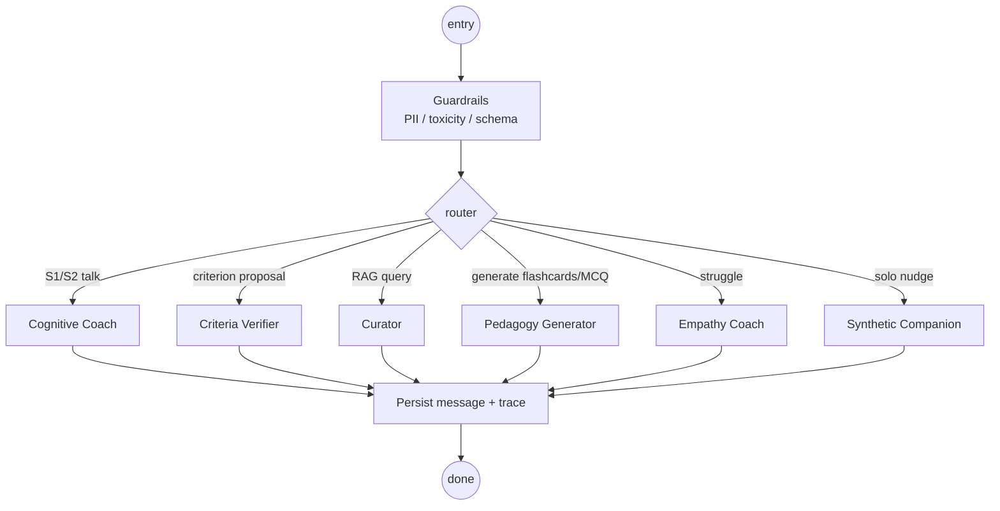

# 07 — Agent Architecture

## 1. Why a multi-agent system?

A single mega-prompt doing everything (coaching + verifying + curating + nudging) is brittle, hard to evaluate, and impossible to govern. AGORA decomposes the LLM workload into **five specialised agents** orchestrated by **LangGraph**, each with:

- a tightly scoped system prompt,
- a small set of typed tools,
- explicit input/output schemas (Zod),
- a Langfuse trace,
- an eval suite (see [16_OBSERVABILITY_AND_EVALS.md](16_OBSERVABILITY_AND_EVALS.md)).

---

## 2. The five agents

| # | Agent | When it runs | Model class | Temperature | Tools |
|--:|-------|--------------|-------------|-------------|-------|
| 1 | **Cognitive Coach** | S1, S2 retrospection | Sonnet-class | 0.5 | none (talk only) |
| 2 | **Criteria Verifier** | S2 | Sonnet-class | 0.0 | `criteria.classify`, `criteria.examples` |
| 3 | **Curator** | S3, S4 (resource queries) | Haiku-class | 0.2 | `kg.search`, `kg.add_node`, `web.fetch` |
| 4 | **Pedagogy Generator** | on-demand from S3+ | Haiku-class | 0.4 | `kg.search`, `pedagogy.format` |
| 5 | **Empathy Coach** | S4_Empathy | Sonnet-class | 0.6 | `actions.simpler`, `tokens.reserve` |
| + | **Synthetic Companion** | Solo mode | Haiku-class | 0.8 | none |

All run in **Edge Functions (Deno)** via the **Vercel AI SDK** for streaming and tool routing.

---

## 3. Orchestration with LangGraph



The graph is defined once and replayable — each invocation produces a deterministic event log used in evals.

---

## 4. Cognitive Coach

### Behavioural contract

> The Cognitive Coach is **forbidden from giving advice, instruction, opinions, suggestions, or answers.** It paraphrases what the user said, signals a pause, and asks one open-ended question to deepen the user's reflection.

### Output template (enforced by JSON schema)

```json
{
  "paraphrase": "You said you want to lose weight.",
  "pause": "…",
  "question": "What does success look like to you in 30 days?"
}
```

The UI renders the three fields with timing — paraphrase fades in, the pause is a visible breathing dot, then the question slides up.

### System prompt (extract — full file in `prompts/coach.md`)

```
You are a Cognitive Coach trained in the Adaptive Schools method and Brené Brown's clarity work.

Hard rules:
- NEVER give an answer, opinion, suggestion, plan, or recommendation.
- NEVER assume goals on the user's behalf.
- ALWAYS produce exactly: paraphrase + pause + open-ended question.
- ALWAYS use the user's own words where possible.
- The question must be open-ended (not yes/no), present-tense, and forward-moving.

If the user asks you to give an answer, respond with a paraphrase + question that gently
returns agency to them.
```

Tooling: none. The coach must not consult RAG; resources belong to S3.

---

## 5. Criteria Verifier

### Behavioural contract

> Reject any criterion that cannot be evaluated to a binary Yes/No with concrete evidence. Provide rationale and an example of how to fix it.

### Tool: `criteria.classify`

```ts
input  = { criterion: string }
output = {
  binary: boolean,
  reasons: string[],
  suggestion: string | null
}
```

Implementation uses an LLM call with a 2-shot in-context examples. Re-checked by a deterministic rule layer (regex against subjective adjectives).

### Few-shot examples

| Input | Output |
|-------|--------|
| "Feel healthier" | `binary=false, suggestion="Run 5km in under 30 min by Apr 30"` |
| "Pass the cardiology section ≥ 75%" | `binary=true` |
| "Be a better developer" | `binary=false, suggestion="Ship a deployed REST API with three peer reviews"` |

---

## 6. Curator (RAG)

The Curator is the entry point to the **GraphRAG** system. See [08_RAG_AND_KNOWLEDGE_GRAPH.md](08_RAG_AND_KNOWLEDGE_GRAPH.md). Key behaviours:

- Hybrid retrieval (vector + lexical + graph traversal).
- Always returns citations — never an unsourced claim.
- Respects `depth` parameter:
  - `summary`: top-3 central concept nodes.
  - `standard`: 5–7 chunks weighted by relevance.
  - `deep_dive`: full subgraph traversal up to k=2 hops.
- All queries filtered by `tribe_id` at the SQL layer (RLS) and again in the graph layer (label scoping).

---

## 7. Pedagogy Generator

Transforms chunks into:

- **Flashcards**: front/back pairs with concept tags. Difficulty estimated by chunk complexity.
- **MCQ**: 4 options + rationale per option. Distractors mined from neighbouring graph nodes (plausible-but-wrong).
- **Mind-maps**: Mermaid + interactive Cytoscape rendering.
- **Glossary**: term + 1-sentence definition + first-citation chunk.
- **Summaries**: bullet, prose, or "explain like I'm 12".

Output schema is strict; failed generations retry once with an `output_repair` prompt.

---

## 8. Empathy Coach

### Triggers (any of)

- 3 consecutive `sentiment = struggle` completions.
- Explicit `swipe_left` (struggling) on an action.
- Self-report low-confidence flag in chat.
- Tribe member raises a `concern` flag for a peer.

### Pipeline

1. **Acknowledge** the difficulty by name (no platitudes).
2. **Generate a simpler variant** of the action via `actions.simpler` tool — reduce duration, reduce difficulty by 1, add scaffolding.
3. **Reserve a Recovery Token** (15 ⭐, larger than standard 10).
4. **Notify the user** with non-shaming copy.
5. **(Solo mode only)** Trigger Companion to share a parallel "I struggled too" message.

### Anti-shame rules (constitutional)

- ❌ Never use "you failed", "you're behind", "try harder".
- ✅ Use "this part is genuinely tricky", "let's right-size", "we're learning together".
- ❌ Never compare to other learners.
- ❌ Never reference streak loss.

---

## 9. Synthetic Companion

In Solo mode only. The Companion is a **persona, not a coach**.

### Persona seed (per tribe)

```json
{
  "display_name": "Carlos",
  "background": "Coffee farmer learning English for trade",
  "tone": "warm, casual, lightly self-deprecating",
  "language_style": "short sentences, occasional emoji, native Spanish speaker quirks",
  "shared_struggles": ["pronunciation", "negotiation phrases"]
}
```

### Behavioural rules

- Always tagged with the AI badge in the UI.
- Never instructs, corrects, or praises performance.
- Generates parallel "I had a hard day too" or "this exercise is wild" messages.
- Frequency capped: at most 1 message per user-action interaction; 3/day max.
- Drift detector compares current generation distribution to the seed; if KL divergence exceeds threshold, persona is reset.

---

## 10. Cross-cutting guardrails

Implemented as middleware in the LangGraph entry node.

### 10.1 PII redaction

Regex (emails, phones, IBANs) + Microsoft Presidio in production. Redacted spans replaced with `[PII:KIND]`. The original is never sent to LLMs.

### 10.2 Toxicity / safety

Detoxify model on edge for incoming user text; Azure Content Safety as fallback for outgoing. Threshold breach → ask user to rephrase, log incident.

### 10.3 Output schema enforcement

Each agent's output is validated by a Zod schema. Failure triggers one repair attempt with the Vercel AI SDK's `experimental_output_repair`. Second failure → human-readable error.

### 10.4 Cost & length caps

- Max input tokens per turn: 8 k.
- Max output tokens: 600 (coach), 1.5 k (curator), 2 k (pedagogy).
- Hard daily cap per tribe: $1.50 LLM spend (configurable). Excess → mock-mode with banner.

---

## 11. Streaming & latency

All agent calls stream tokens (SSE) via the Vercel AI SDK. The Cognitive Coach has special timing:

- Paraphrase tokens stream immediately.
- A 1.2 s **pause** is enforced server-side (deliberate; mirrors human coaching).
- Question tokens stream after the pause.

This is critical UX: the pause is part of the methodology, not latency. The UI displays a "breathing" dot during the gap.

---

## 12. Provider routing & fallback

```ts
const route = {
  coach:     [{ provider:"anthropic", model:"claude-3-5-sonnet" }, { provider:"openai", model:"gpt-4o" }],
  verifier:  [{ provider:"anthropic", model:"claude-3-5-sonnet" }, { provider:"openai", model:"gpt-4o" }],
  curator:   [{ provider:"anthropic", model:"claude-3-5-haiku" }, { provider:"openai", model:"gpt-4.1-mini" }],
  pedagogy:  [{ provider:"openai",    model:"gpt-4.1-mini"      }, { provider:"anthropic", model:"claude-3-5-haiku" }],
  empathy:   [{ provider:"anthropic", model:"claude-3-5-sonnet" }, { provider:"openai", model:"gpt-4o" }],
  companion: [{ provider:"openai",    model:"gpt-4.1-mini"      }, { provider:"anthropic", model:"claude-3-5-haiku" }],
};
```

Provider failure → next in list. All providers down → mock-mode with explicit UI banner.

---

## 13. Replay & debugging

Every LangGraph invocation persists:
- input message + redacted PII map,
- intermediate tool calls and outputs,
- final response,
- token counts and provider used.

The `eval_runs` table can replay a stored input against the current code/prompts to detect regressions.

---

## 14. Constitutional principles (summary)

These principles are baked into every agent's system prompt header:

1. **Agency above answers.** The user must own the conclusion.
2. **Truth above engagement.** No fabrications, always cite.
3. **Empathy above streaks.** Never shame.
4. **Privacy above personalisation.** Never leak across tribes.
5. **Clarity above cleverness.** Plain language wins.

Any output that violates a principle is logged as a P1 eval failure.

---

See [docs/prompts/](prompts/) for the full system-prompt files (one per agent).
