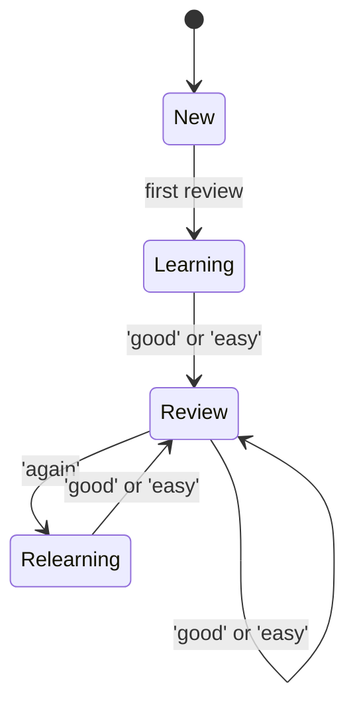

# 09 — Pedagogical Engine

> The science layer. AGORA is opinionated about *how* people learn.

## 1. Three core algorithms

| Algorithm | Purpose | Where applied |
|-----------|---------|---------------|
| **FSRS-6** | Spaced repetition scheduling | Flashcard reviews |
| **Bayesian Knowledge Tracing (BKT)** | Mastery estimation per concept | Action selection, mastery dashboard |
| **Multi-armed bandit (Thompson sampling)** | Optimal nudge / content variant selection | Push timing, daily action ordering |

---

## 2. FSRS-6 (Free Spaced Repetition Scheduler v6)

FSRS-6 is the current state of the art (≥ 30 % more efficient than SM-2/Anki classic). It models each card with two latent variables — **Stability (S)** and **Difficulty (D)** — and computes **Retrievability (R)** as a function of elapsed time.

```
R(t) = (1 + t / (S · F))^C
```

Constants `F` and `C` are tuned globally; `S` and `D` per-card per-user.

### State machine



### Grading scale

`again | hard | good | easy` — captured via UI buttons. Latency (ms-to-grade) feeds into difficulty smoothing.

### Persistence

`fsrs_state` table holds the per-card state. The scheduler runs server-side via an RPC `fsrs.next_due(user_id)` — **no proprietary algorithm stored in the client** (preserves auditability).

### Daily review queue

```sql
select * from public.fsrs_state
where user_id = $1
  and due <= now()
order by due asc
limit 30;
```

The user studies the queue; AGORA caps the daily workload at 25 minutes (one Pomodoro) to prevent burnout — surplus cards roll over.

### Why FSRS-6, not SM-2?

SM-2 was designed in 1985. FSRS-6 (2024) outperforms it by every published metric: fewer cards reviewed, higher retention. It is open-source and has reference implementations in TS, Python, and Rust. Adopted by Anki itself.

See [adr/0003-fsrs-spaced-repetition.md](adr/0003-fsrs-spaced-repetition.md).

---

## 3. Bayesian Knowledge Tracing (BKT)

For each `(user, concept)` pair, BKT models the probability the user has *mastered* the concept (`p_known`) and updates it after every observed performance event.

### Parameters

| Symbol | Meaning | Default |
|--------|---------|--------:|
| `P(L_0)` | prior knowledge | 0.10 |
| `P(T)` | learning rate per opportunity | 0.15 |
| `P(S)` | slip (got wrong despite knowing) | 0.10 |
| `P(G)` | guess (got right despite not knowing) | 0.20 |

### Update equations

After a *correct* response on concept `c`:
```
P(L | correct) = P(L) (1 - P(S)) / [P(L) (1 - P(S)) + (1 - P(L)) P(G)]
P(L_new)       = P(L | correct) + (1 - P(L | correct)) · P(T)
```

After an *incorrect* response — symmetric formula.

### Where signals come from

- Flashcard grades (`again` / `hard` mark wrong).
- MCQ answers.
- Action completions (with concept tags).
- Peer reviews.

### Where mastery is *used*

- The Curator deprioritises chunks tagged with concepts above `p_known = 0.85`.
- The Pedagogy Generator avoids generating cards for mastered concepts unless explicitly asked.
- The dashboard shows a heat-map of mastery per concept to the tribe (only own user's data — privacy).

---

## 4. Action sequencing — bandit-driven

We have ≤ 5 candidate actions per day. Order matters: starting with too-hard frustrates; too-easy bores. We treat ordering as a **contextual multi-armed bandit**:

- **Arms**: action templates (or difficulty tiers within a template).
- **Context**: current BKT mastery vector + recent sentiment.
- **Reward**: `1` if completed with non-struggle sentiment, `0.5` if completed with struggle, `0` if dismissed.
- **Algorithm**: Thompson sampling with Beta(α, β) per arm.

This is the engine behind the *adaptive* in "AGORA". Each tribe member has their own bandit; nothing crosses tribes.

---

## 5. Mastery dashboard (UI)

Per concept, the user sees:

- A bar (0–100 %) for current `p_known`.
- The trajectory over the last 14 days.
- Linked flashcards / actions / chunks.
- A "review" button that re-queues 5 cards from this concept.

The tribe view shows aggregated, **anonymised** progress (medians, not individual rows) — privacy first.

---

## 6. Forgetting curve & re-engagement

When `R(t)` for a concept's representative cards drops below 0.7, the system:

1. Emits a `concept.forgetting` event.
2. Schedules a low-friction (≤ 3-min) review action for the next day.
3. The Coach (in S4) may surface "I notice JWT refresh tokens are getting fuzzy — would today be a good time to revisit?" — *as a question*, not a directive.

---

## 7. Quiz / MCQ scoring

- Each MCQ has 4 options, `is_correct` flags.
- Score per session: `correct / total`.
- BKT updated per question with concept tag.
- Distractor analysis: if a distractor is chosen `> 40 %` of the time, mark it for human review (could be poorly written).

---

## 8. Mindmap interactivity

The mind-map is the visual mirror of the knowledge graph for that goal:

- Nodes scaled by salience.
- Edges weighted.
- Click a node → reveals chunks + flashcards + mastery.
- Drag to explore; pinch-to-zoom on mobile.

Implemented with **Cytoscape.js** + `cose-bilkent` layout. Mobile gesture parity with `pinch-zoom-cytoscape`.

---

## 9. Why not just "show videos"?

Two reasons:

1. The team's vision explicitly rejects passive consumption. AGORA forces active recall.
2. Active recall + spaced repetition + cognitive coaching is the most evidence-supported triad in the learning-science literature (Roediger & Karpicke 2006; Cepeda et al. 2008; SuperMemo lineage; Dunlosky 2013 meta-analysis).

---

## 10. Personalisation knobs

| Knob | UI surface | Effect |
|------|------------|--------|
| Daily cap (15/25/45 min) | Settings | bounds review queue |
| Difficulty preference | Onboarding | shifts bandit prior |
| Modality preference (read/listen/voice) | Settings | reorders content delivery |
| Language | Settings | drives generation language |

---

## 11. Validation & evals

- **FSRS** correctness verified against the official open-source reference test cases.
- **BKT** validated by replaying historical traces and confirming convergence.
- **Bandit** A/B vs random ordering — measured by 7-day completion rate.

See [16_OBSERVABILITY_AND_EVALS.md](16_OBSERVABILITY_AND_EVALS.md) for the eval suite.

---

## 12. Future work (out of v1)

- Item Response Theory (IRT) for MCQ calibration.
- Deep Knowledge Tracing (DKT) when we have ≥ 100 k events.
- Spaced repetition for *actions*, not just flashcards (FSRS-style scheduling of skills).
- Cross-tribe public commons concept identity (carefully, with consent).

---

See [10_GAMIFICATION_AND_TOKENS.md](10_GAMIFICATION_AND_TOKENS.md) for how completion turns into reward.
