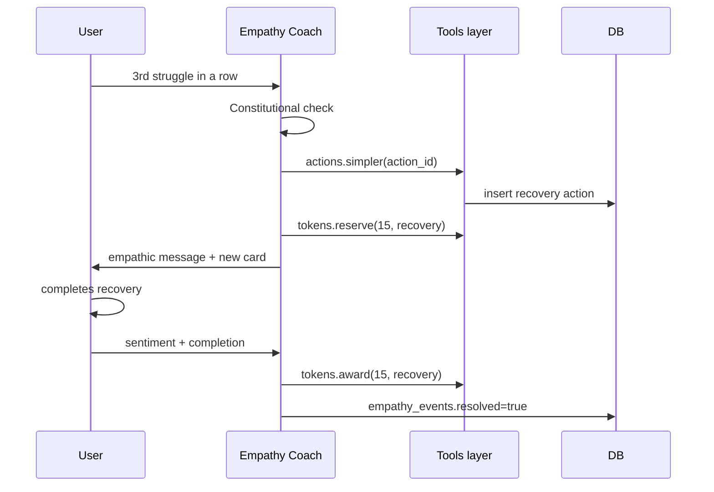

# 11 — Empathy Loop

> When a learner struggles, the platform leans in, not down.

## 1. Why this is a first-class system

Most EdTech treats failure as a metric to penalise. The literature on motivation (Dweck's *growth mindset*, Deci & Ryan's *self-determination theory*, Kolb's *learning cycle*) shows the opposite: struggle is the substrate of growth, *if* it is met with empathy, scaffolding, and small wins.

The Empathy Loop is AGORA's institutional answer.

---

## 2. Trigger conditions

The Empathy Coach activates when **any** of these fires:

| Signal | Threshold |
|--------|-----------|
| Sentiment streak | 3 consecutive `struggle` ratings on actions |
| Explicit struggle swipe | One swipe-left on an action card |
| Self-report flag | User taps "I'm stuck" in chat |
| Repeated card lapses | ≥ 3 `again` grades on the same flashcard concept in 7 days |
| Tribe peer concern | A tribemate flags a peer (with consent prompt) |
| Behavioural decay | Daily completion rate drops > 60 % vs. 7-day baseline |
| Long silence | No interaction for 72 h + a goal active |

Each trigger is logged in `empathy_events.trigger` with structured payload.

---

## 3. The recovery protocol

### Step-by-step

1. **Detect & acknowledge.** The system does not silently lower difficulty. It surfaces the change *with explicit empathy and a name for the difficulty*.
   > "JWT refresh tokens are tricky — most engineers stumble here. Let's right-size."
2. **Right-size the next action.** `actions.simpler` reduces:
   - Duration by ≥ 30 % (cap at 5 min minimum).
   - Difficulty by 1 step.
   - Adds scaffolding (worked example, hint, visual diagram).
3. **Reserve the Recovery Token.** 15 ⭐ — *higher* than standard. Reservation persists across crashes via a row in `empathy_events`.
4. **(Solo only) Companion mirroring.** Carlos sends "I bombed mine yesterday too 😅" — strictly bounded by the Companion contract (see [07](07_AGENT_ARCHITECTURE.md)).
5. **Pair-buddy escalation (Tribe).** If the same user fires Empathy 3 times in 7 days, the Moderator is gently invited to pair them with a buddy. **No automatic exposure to peers without consent.**
6. **Tribe-level rollback.** If 50 %+ of the tribe is in Empathy state simultaneously, the system proposes a tribe-wide rollback to S2 to re-scope criteria.
7. **Resolve.** On completion, the token is awarded, `empathy_events.resolved = true`, and a single retro question is logged for future evals.

---

## 4. Constitutional rules for empathic copy

The Empathy Coach prompt enforces:

- ✅ Name the difficulty: "This part is genuinely tricky."
- ✅ Acknowledge effort: "You showed up — that's the work."
- ✅ Offer agency: "Want to try a smaller bite, or rest until tomorrow?"
- ❌ No "you failed", "you're behind", "try harder", "don't give up".
- ❌ No comparisons: "Most learners…" / "Your tribemates already…"
- ❌ No streak-loss language.
- ❌ No motivational fortune-cookies ("Believe in yourself!").

Eval suites test for these explicitly (LLM-as-judge + regex). Any breach is a P1 regression.

---

## 5. UI behaviour

- A non-intrusive **Recovery Banner** slides in from the bottom of the action deck:
  > *"Right-sizing the next step. 15 ⭐ when you finish."*
  - Dismissible. Auto-hides on completion.
- The action card is visually marked **"Recovery"** with a soft palette shift (calm cyan) — see [13_DESIGN_SYSTEM.md](13_DESIGN_SYSTEM.md) for the colour rule.
- Sentiment capture remains the same 3-emoji choice; no extra friction.
- A subtle micro-animation breath (4-second loop) plays on the deck for the rest of the session.

---

## 6. Affective signals (what we *don't* do in v1)

We deliberately do **not** use:
- Camera-based facial emotion detection (consent + accuracy + bias risks).
- Keyboard cadence biometrics.
- Voice prosody emotion recognition.

Why? Three reasons: ethics, accuracy, and consent. Self-report (3-emoji) + behavioural signals (streak, lapses) are sufficient and respectful. Future versions may expand *with explicit, granular opt-in*.

---

## 7. Scope-rescue (the bigger lever)

Sometimes the issue is the *goal*, not the user. If:

- Two tribe members fire Empathy in the same 7-day window, **and**
- Goal deadline confidence (a model-derived score) drops below 0.5, **and**
- The tribe's median sentiment for 14 days ≤ neutral

…the system proactively proposes:

> *"Would you like to revisit your success criteria together? Sometimes the path is longer than we first thought — and that's data, not failure."*

This routes the FSM to S2 with the original criteria preserved as `goal.history.previous_criteria` for transparency.

---

## 8. Data model

`empathy_events` (see [05_DATA_MODEL.md](05_DATA_MODEL.md)) records every trigger, recovery, and resolution. It is the cornerstone of the eval suite for the Empathy Coach: every event can be replayed and judged.

---

## 9. Metrics

| Metric | Target |
|--------|-------:|
| Trigger → recovery action issued (latency) | p95 < 3 s |
| Recovery action completion rate | ≥ 70 % |
| Recovery → next-day return rate | ≥ 80 % |
| Self-reported "felt seen" survey (post-recovery) | ≥ 4 / 5 |
| False positives (user feels patronised) | ≤ 5 % |

The "felt seen" micro-survey is shown only to ~10 % of recoveries to avoid survey fatigue.

---

## 10. Failure modes

| Failure | Behaviour |
|---------|-----------|
| LLM unable to generate simpler action | Fallback to template library (10+ pre-written scaffolds per concept type) |
| Tokens RPC fails | Retry with idempotency key; resolved=false until success |
| User dismisses recovery banner | No nag; system does not re-trigger for 24 h |
| Empathy fires too often (≥ 3 / day) | Coach surfaces a tribe-level "let's pause and reflect" prompt — not just task-level |

---

## 11. Why this matters more than tokens

Tokens get press. Empathy is what keeps people on the platform. This loop is the difference between AGORA being a learning *experience* and another app users uninstall on day 3.

---

See [12_UI_UX_SPEC.md](12_UI_UX_SPEC.md) for the screen-level treatment of the recovery banner and palette shift.
