# 18 — Deployment

> Boring, predictable releases. One-click rollback. Zero-downtime migrations.

## 1. Environments

| Env | URL | Data | LLM | Mock-mode |
|-----|-----|------|-----|-----------|
| `local` | localhost | docker compose | mocks by default | yes |
| `preview` | `pr-<n>.agora.dev` | ephemeral DB per PR | mocks | yes |
| `staging` | `staging.agora.dev` | persistent, anonymised | real, low-tier | toggleable |
| `demo` | `demo.agora.dev` | seeded canonical | mocks | **forced on** |
| `prod` | `app.agora.dev` | real | real | only on circuit-break |

`demo` exists specifically for the hackathon presentation: deterministic, network-resilient, can be reset in < 5 s.

---

## 2. Hosting topology

- **Web (PWA):** Vercel — global edge, automatic preview per PR.
- **API & realtime:** Supabase project per env.
- **Edge functions:** Supabase Edge (Deno) co-located with DB region.
- **Vector + graph:** Postgres + pgvector + AGE in the same Supabase instance.
- **Object storage:** Supabase Storage; public bucket only for marketing.
- **CDN:** Vercel + Supabase CDN; service-worker offline cache for the PWA shell.
- **Region:** primary EU (Frankfurt) for GDPR; replica reads on demand. US replica added when justified.

---

## 3. CI/CD

```mermaid
flowchart LR
  A[push to PR] --> B[CI: tests + evals + a11y + size]
  B --> C[preview deploy: Vercel + ephemeral Supabase]
  C --> D[review + QA + LHCI]
  D --> E[merge to main]
  E --> F[CI: full suite + migrations dry-run]
  F --> G[deploy staging]
  G --> H[smoke + nightly real-LLM evals]
  H --> I[manual promote tag]
  I --> J[deploy prod canary 5%]
  J --> K[autonomous health check 15 min]
  K --> L[full prod rollout]
```

- **GitHub Actions** orchestrates. One workflow file per stage.
- **Migrations:** SQL files in `supabase/migrations/`, applied with `supabase db push --linked`. Reversible by design (every up-migration has a down-migration tested in CI).
- **Feature flags:** [Unleash](https://www.getunleash.io/) (self-hostable). Risky changes ship dark; rolled out by cohort.

---

## 4. Release cadence

- Trunk-based development, short-lived branches.
- Default cadence: ship on green; multiple deploys / day.
- Release notes auto-generated from conventional commits.
- Public **changelog** updated on every prod deploy.

---

## 5. Migrations

### 5.1 Rules

1. Backwards-compatible — old code keeps running for ≥ 1 release.
2. Two-phase for breaking changes: add new column → backfill → switch reads → remove old column in a later release.
3. RLS policies migrated atomically with the table they protect.
4. CI runs migrations against a snapshot of staging data.

### 5.2 Special tables

- `tokens_ledger`, `state_transitions` — append-only; never `ALTER` to remove a column.
- AGE graphs — schema changes require a graph re-build script in `scripts/age/rebuild.ts`.

---

## 6. Rollback

- **App:** Vercel preserves the last 5 prod deploys; instant rollback button.
- **DB:** point-in-time recovery (PITR) up to 7 d on prod; tested quarterly.
- **Functions:** previous Edge revisions kept for 24 h; one-command rollback.
- **Feature flags:** kill-switch at flag level disables a risky path without a redeploy.

---

## 7. Secrets management

- Vercel + Supabase secret stores; never in repo.
- 1Password vault as source-of-truth for human ops.
- Rotation: 90 d for service keys; immediate on incident.
- `gitleaks` runs in CI on every PR.

---

## 8. Observability deploy

- Langfuse + Grafana + Loki + Sentry deployed via the same IaC repo (`infra/`).
- IaC: Terraform + Pulumi modules; CD via Atlantis.
- Backups: nightly DB snapshot, weekly off-site copy (different cloud).

---

## 9. Hackathon "demo" environment

- Single-click deploy via `make demo`.
- Forces `USE_MOCKS=true`, seeds canonical tribes, disables outbound network for LLM providers.
- Reset script: `make demo-reset` truncates non-seed data and replays seed in < 5 s.
- Local laptop fallback: `make local-demo` runs a fully offline Supabase + mock LLM, so a stage Wi-Fi outage does not kill the demo.

---

## 10. Performance & cost guardrails on deploy

- Bundle-size guard fails CI if main entry > 120 kB gz.
- LCP budget regression on Lighthouse fails CI.
- Cost-projection script estimates LLM spend delta per PR — alerts if > +20 %.

---

## 11. DR / business continuity

- RPO 5 min (PITR + WAL streaming).
- RTO 30 min for prod restore.
- Quarterly DR drill: restore staging from backup; verify integrity; document timing.

---

## 12. Compliance hooks

- All deploys recorded with: SHA, deployer, evals snapshot, migration ids, change log.
- SBOM generated per build (cyclonedx).
- Vulnerability triage SLA: critical 24 h, high 72 h, medium 14 d.

---

See [15_SECURITY_AND_PRIVACY.md](15_SECURITY_AND_PRIVACY.md) for related controls, [16](16_OBSERVABILITY_AND_EVALS.md) for monitoring, [20_BUILD_ROADMAP.md](20_BUILD_ROADMAP.md) for sequencing.
